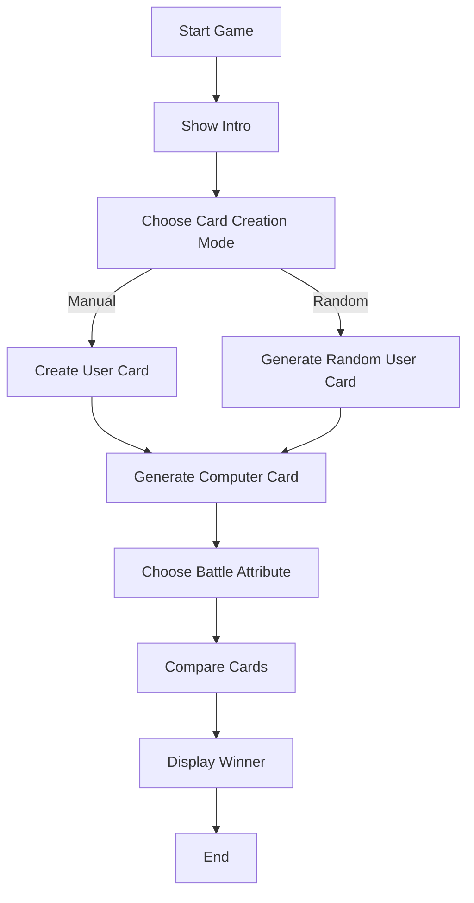

# Top Trumps: Countries

This project was developed as part of a college lesson about C.

The original challenge proposal came from these repositories:

* [Cadastro de Cartas](https://github.com/Cursos-TI/cadastro-cartas-sabrigs)
* [Desafio Lógica Super Trunfo](https://github.com/Cursos-TI/desafio-l-gica-super-trunfo-sabrigs)

The idea behind this was to simulate a simplified version of the classic card game *Top Trumps* (or Super Trunfo, in portuguese), where two cards battle by comparing attributes such as population, area, GDP and population density.

## Scope

One important decision was intentionally keeping the game limited to only two cards.

An earlier idea was to create a complete deck system using arrays and dynamic memory allocation (`malloc`), allowing the player to register multiple cards and choose which one to play with.

However, since the challenge only required comparing two cards, adding deck management and dynamic memory allocation would increase complexity without contributing directly to the learning goals of the assignment.

Because of that, the final version uses:

* only two card variables;
* stack allocation instead of heap allocation;
* fixed game flow;
* direct comparison between cards.

This helped keep the focus on core introductory concepts instead of prematurely introducing advanced memory management.

# Game logic

The game follows this flow:

# Some ideas* future improviments

| Category             | Improvements                                                                                                                                                                 | Topics to Study                                                |
| -------------------- | ------------------------------------------------------------------------------------------------------------------------------------------------------------------------------------- | -------------------------------------------------------------- |
| Input Validation     | • Validate invalid numeric input • Prevent negative values • Protect against division by zero • Validate string size before storing • Study safer alternatives to `scanf` | Buffer handling Defensive programming Input sanitization |
| Code Reusability     | • Create a generic comparison function • Reduce duplicated `winner_*()` logic • Explore enums for attribute selection                                                           | Abstraction Generic functions Enums in C                 |
| Game Flow            | • Add "play again" loop • Create main menu loop • Add score system • Add multiple battle rounds                                                                              | Loops State management Game flow architecture            |
| Data Organization    | • Generate different cities and states • Create external card database • Load cards from files                                                                                  | File handling CSV/TXT parsing Dynamic data               |
| Project Architecture | • Split code into `.h` and `.c` files • Create modules for game/card/utils • Organize project folders                                                                           | Modularization Header files Compilation process          |
| Game Balance         | • Improve super power formula • Normalize attribute scales • Add weighted scoring system                                                                                        | Balancing systems Normalization Game design logic        |
| User Experience      | • Improve terminal layout • Add colors to interface • Add animations/loading effects • Improve text formatting                                                               | Terminal UX ANSI escape codes CLI design                 |

*The ideas were generated with ChatGPT to help me to improve my code skills.
