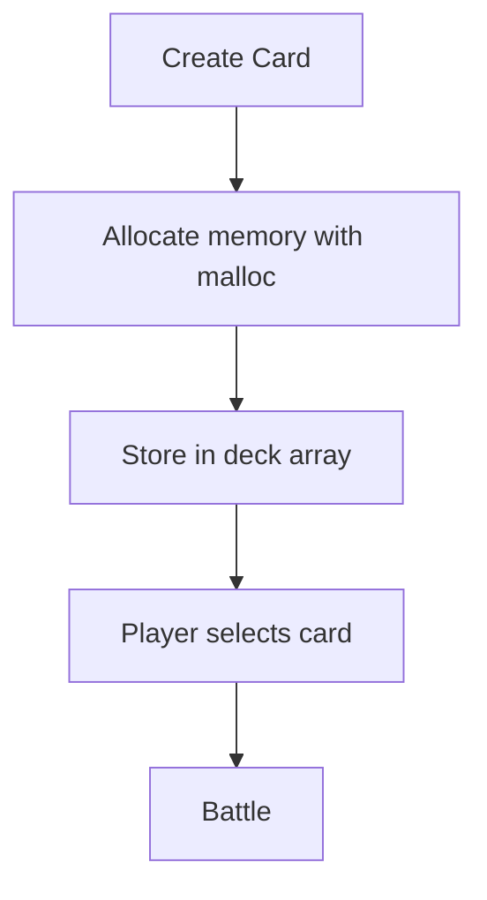
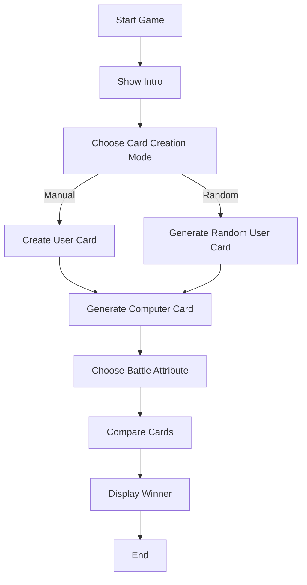

# Top Trumps: Countries

This project was developed as part of an introductory programming lesson exercise using the C language.

The original challenge proposal came from my college GitHub Classroom repositories:

* [Cadastro de Cartas](https://github.com/Cursos-TI/cadastro-cartas-sabrigs)
* [Desafio Lógica Super Trunfo](https://github.com/Cursos-TI/desafio-l-gica-super-trunfo-sabrigs)

The idea behind the exercise was to simulate a simplified version of the classic card game *Top Trumps* (or Super Trunfo, in portuguese), where two cards battle by comparing attributes such as population, area, GDP and population density.

While developing the project, the implementation gradually evolved beyond just "making it work". The exercise became an opportunity to practice:

* problem decomposition
* modular programming
* function organization
* data modeling with structs
* program flow architecture
* scope management during development

One important design decision was intentionally keeping the game limited to only two cards.

An earlier idea was to create a complete deck system using arrays and dynamic memory allocation (`malloc`), allowing the player to register multiple cards and choose which one to play with.

Initial concept:



However, after reviewing the actual requirements of the exercise, the implementation was simplified on purpose.

Since the challenge only required comparing two cards, adding deck management and dynamic memory allocation would increase complexity without contributing directly to the learning goals of the assignment.

Because of that, the final version uses:

* only two card variables (`user` and `robot`)
* stack allocation instead of heap allocation
* fixed game flow
* direct comparison between cards

This helped keep the focus on core introductory concepts instead of prematurely introducing advanced memory management.

---

# Game logic

The game follows this flow:



---

# Card structure

Each card contains:

| Field          | Description                   |
| -------------- | ----------------------------- |
| code           | Card identifier               |
| city           | City name                     |
| state          | State letter                  |
| pop            | Population                    |
| places         | Touristic places              |
| area           | City area                     |
| gdp            | Gross Domestic Product        |
| pop_density    | Calculated population density |
| gdp_per_capita | Calculated GDP per capita     |
| spower         | Combined "super power" score  |

The project uses a `struct` to group all card data into a single entity.

---

# Technologies and concepts used

## Structs

The game uses a custom struct:

```c id="vwjlwm"
typedef struct card
```

This allows all card attributes to stay grouped together and makes function communication cleaner.

---

## Functions

The project was separated into small specialized functions.

### Card Creation

* `create_card()`
* `random_card()`

### Calculations

* `calc_pop_density()`
* `calc_pib_pcap()`
* `calc_spower()`

### Comparison

* `winner_pop()`
* `winner_area()`
* `winner_pib()`
* `winner_pop_density()`
* `winner_pib_pcap()`
* `winner_spower()`

### Interface / display

* `menu()`
* `menu_fields()`
* `print_card()`
* `print_winner()`

This separation helped avoid large blocks of code inside `main()` and improved readability during development.

---

## Control structures

### switch

Used for:

* selecting card generation mode
* selecting battle attribute

Example:

```c id="mv4qsl"
switch (fight_field)
```

---

## if

Used in comparison functions to determine the winner.

Example:

```c id="k29v8p"
if (a.pop > b.pop)
```

---

## Random generation

The computer card and optional player card use:

```c id="y90f2n"
rand()
```

to generate random attributes.

---

# Future improvements & Study backlog

The items below represent possible improvements and future study paths for the project.

# 🚀 Future Improvements / Study Backlog

The table below represents possible improvements and future study paths for the project.

| Category             | Possible Improvements                                                                                                                                                                                     | Topics to Study                                                |
| -------------------- | --------------------------------------------------------------------------------------------------------------------------------------------------------------------------------------------------------- | -------------------------------------------------------------- |
| Input Validation     | - [ ] Validate invalid numeric input<br>- [ ] Prevent negative values<br>- [ ] Protect against division by zero<br>- [ ] Validate string size before storing<br>- [ ] Study safer alternatives to `scanf` | Buffer handling<br>Defensive programming<br>Input sanitization |
| Code Reusability     | - [ ] Create a generic comparison function<br>- [ ] Reduce duplicated `winner_*()` logic<br>- [ ] Explore enums for attribute selection                                                                   | Abstraction<br>Generic functions<br>Enums in C                 |
| Game Flow            | - [ ] Add "play again" loop<br>- [ ] Create main menu loop<br>- [ ] Add score system<br>- [ ] Add multiple battle rounds                                                                                  | Loops<br>State management<br>Game flow architecture            |
| Data Organization    | - [ ] Generate different cities and states<br>- [ ] Create external card database<br>- [ ] Load cards from files                                                                                          | File handling<br>CSV/TXT parsing<br>Dynamic data               |
| Project Architecture | - [ ] Split code into `.h` and `.c` files<br>- [ ] Create modules for game/card/utils<br>- [ ] Organize project folders                                                                                   | Modularization<br>Header files<br>Compilation process          |
| Game Balance         | - [ ] Improve super power formula<br>- [ ] Normalize attribute scales<br>- [ ] Add weighted scoring system                                                                                                | Balancing systems<br>Normalization<br>Game design logic        |
| User Experience      | - [ ] Improve terminal layout<br>- [ ] Add colors to interface<br>- [ ] Add animations/loading effects<br>- [ ] Improve text formatting                                                                   | Terminal UX<br>ANSI escape codes<br>CLI design                 |
